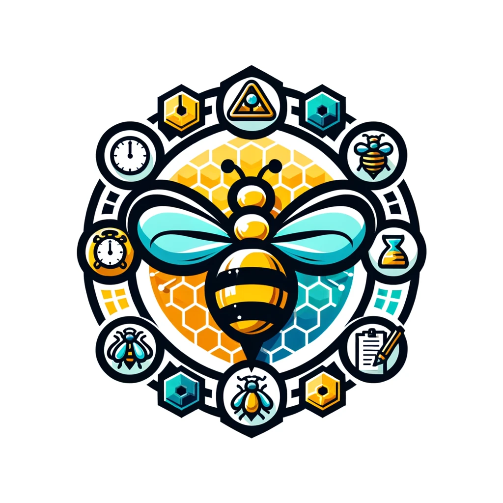
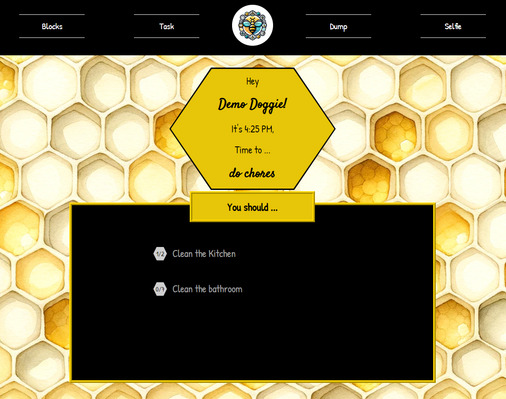
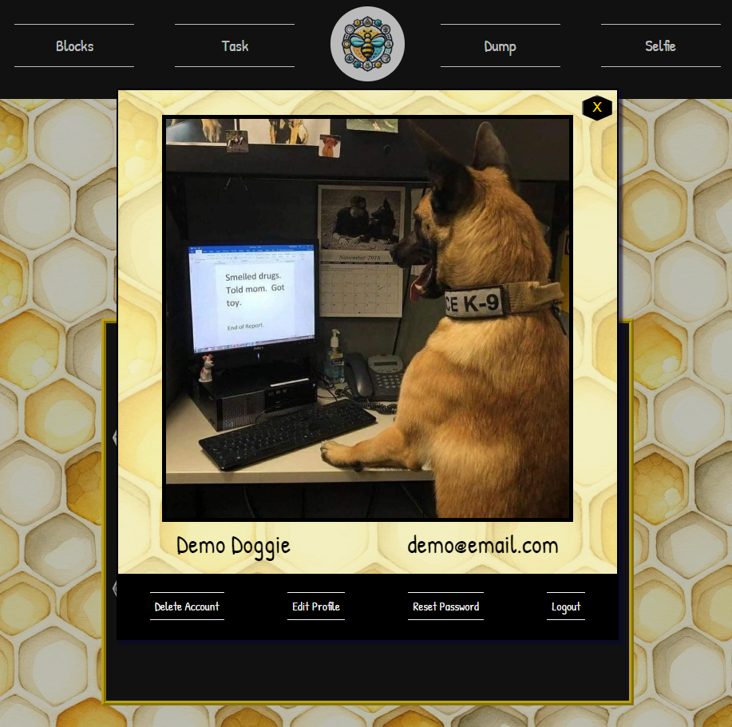
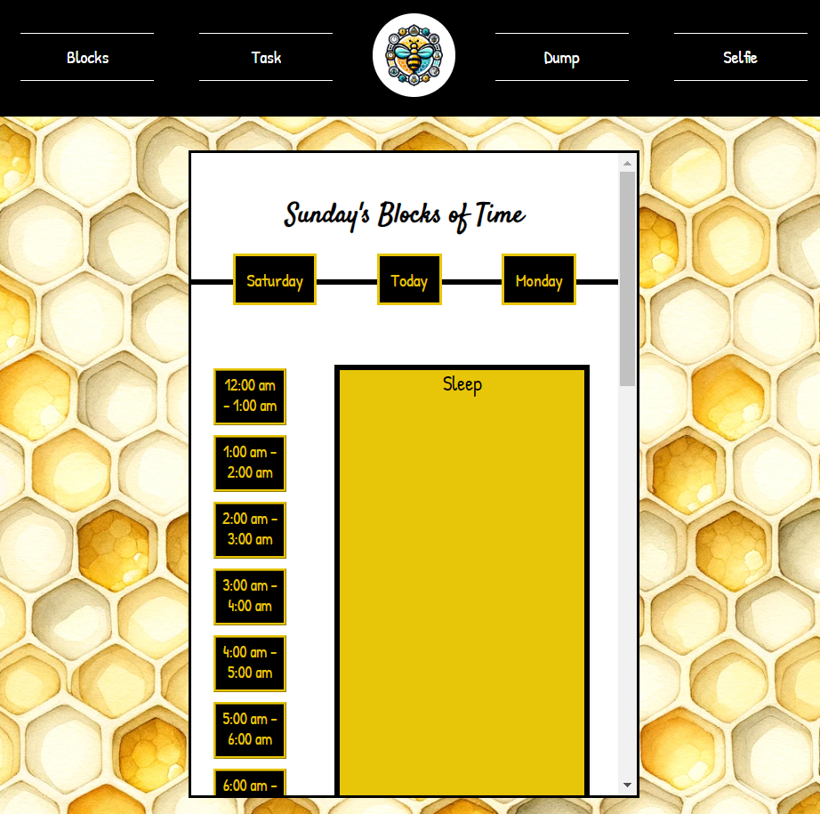
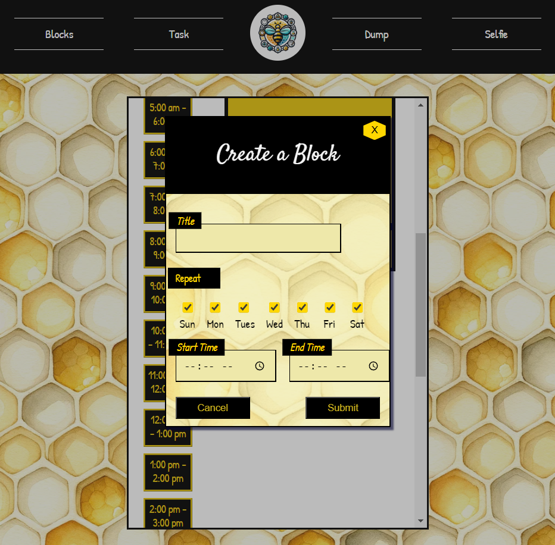
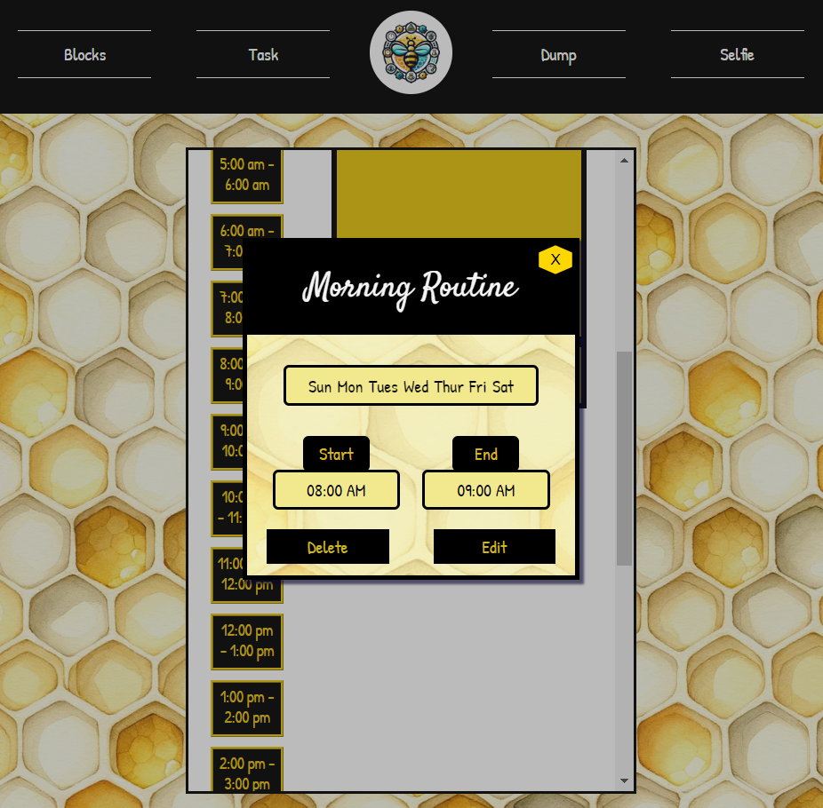
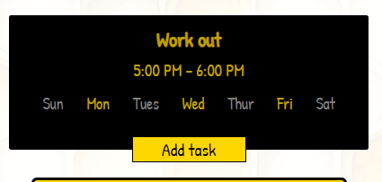
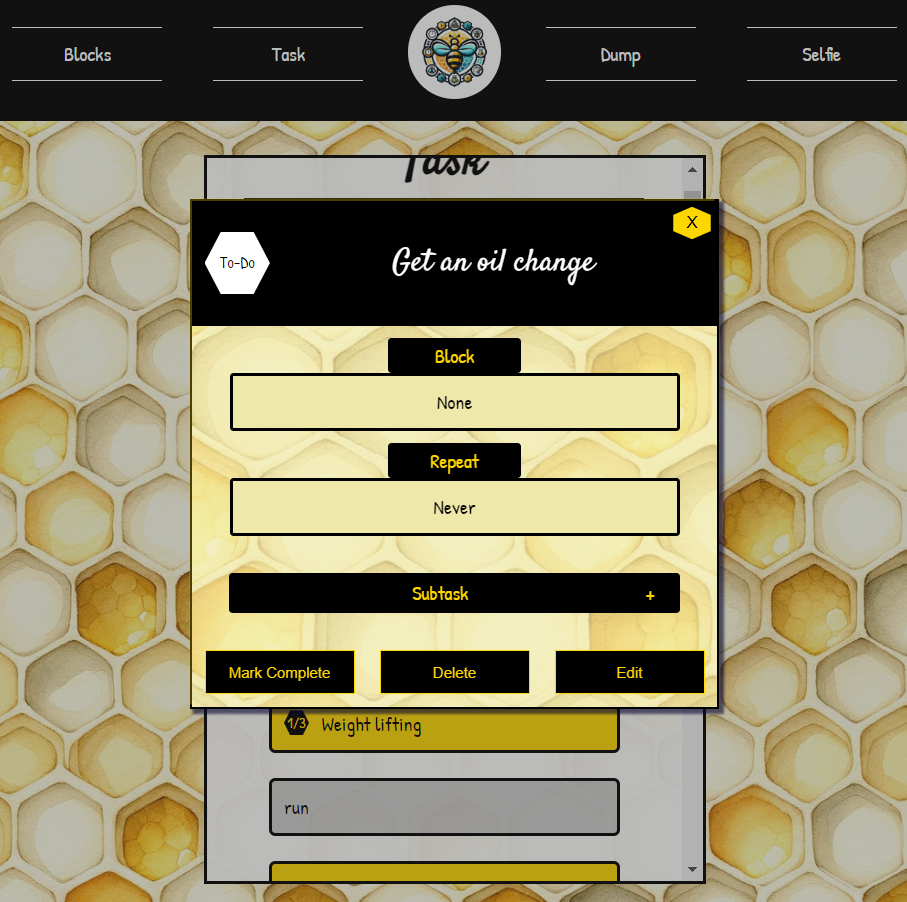
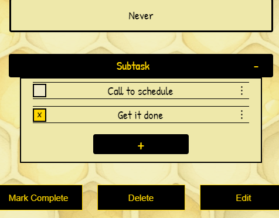

<a name="readme-top"></a>

<br />
<div align="center">
  <a href="https://github.com/othneildrew/Best-README-Template">
    
  </a>

  <h3 align="center">
    Bee Productive
  </h3>

  <p align="center">
    A time blocking task app designed to keep you focused on the task at hand.
    <br />
    <a href=""></a>
    <br />
    <a href="https://trello.com/b/8FFXyDm2/app"><strong>Trello Board »</strong></a>
    <br />
    <br />
    <a href="https://github.com/cparsons9712/busyBees">View Demo</a>
    ·
    <a href="https://github.com/cparsons9712/busyBees/issues">Report Bug</a>
    ·
    <a href="https://github.com/cparsons9712/busyBees/issues">Request Feature</a>
  </p>
</div>

<!-- TABLE OF CONTENTS -->
<details>
  <summary>Table of Contents</summary>
  <ol>
    <li>
      <a href="#about-the-project">About The Project</a>
      <ul>
        <li><a href="#built-with">Built With</a></li>
      </ul>
    </li>
    <li>
      <a href="#getting-started">Getting Started</a>
      <ul>
        <li><a href="#prerequisites">Prerequisites</a></li>
        <li><a href="#installation">Installation</a></li>
      </ul>
    </li>
    <li><a href="#usage">Usage</a></li>
    <li><a href="#roadmap">Roadmap</a></li>
    <li><a href="#contributing">Contributing</a></li>
    <li><a href="#license">License</a></li>
    <li><a href="#contact">Contact</a></li>
    <li><a href="#acknowledgments">Acknowledgments</a></li>
  </ol>
</details>

<!-- ABOUT THE PROJECT -->

## About The Project

<!-- [![Product Name Screen Shot][product-screenshot]](https://example.com) -->

I had an unexpected medical issue that caused me to get very behind on basically everything. Things piled up and every time I thought about one thing I needed to do a whole slew of others came to mind. It felt overwhelming and scary. I would get started on one thing and then get distracted by another and start on that only to get distracted... rinse and repeat until I was too tired to finish all the tasks I had started.
<br>
And then I started time blocking. I set out and made a general schedule and each section had its own dedicated to-do list. Anytime I thought of something unrelated I could tell myself it wasn't time for that. It changed my life.
<br>
I tried many productivity apps but none of them quite fit the bill. I couldn't find an app that did exactly what I wanted. I decided to make my own and Bee Productive was born!

Here's why Bee Productive just works better:

- You stay focused on the task at hand and don't get sidetracked with random tasks.
- When it's time to relax you can do so without guilt because you are doing exactly what your supposed to be doing.
- It helps with anxiety and overwhelm, only showing you a small sliver of tasks at a time, and only those related to the current time block.

<p align="right">(<a href="#readme-top">back to top</a>)</p>

### Built With


[![React][React.js]][React-url]


<p align="right">(<a href="#readme-top">back to top</a>)</p>

<!-- GETTING STARTED -->

## Getting Started with Docker

Running this application with Docker simplifies the setup process and manages the services for you. Follow these steps to get up and running quickly.

### Prerequisites

- Docker Desktop (MUST BE OPEN AND RUNNING)
  - For Windows and Mac: Download and install Docker Desktop from [Docker Hub](https://docs.docker.com/docker-hub/quickstart/)
  - For Linux: Install Docker Engine and Docker Compose following the instructions [here](https://docs.docker.com/engine/install/ubuntu/).

### Installation and Running the Application

1. Clone the Repository

   ```sh
   git clone https://github.com/cparsons9712/busyBees.git
   cd busyBees
   ```

2. Environment Configuration

   - Create a .env file in the root of the backend directory. You can copy the template from .env.copy provided in the repository.

   - Update the .env file with your environment variables as needed. For Docker, ensure DATABASE_HOST is set to the name of your database service defined in docker-compose.yml (typically db).

   - There is also a .env.example in the complete root of the project. Create a .env in the complete root and copy /update the values from the .env.example

   - You only need a gmail email address and password if you will be testing password reset, otherwise you can leave those fields blank
     > [!TIP]
     > Docker makes a new user for you to use with postgres and makes the postgres server. What that means is that you dont need to change anthing in the .env.example unless you want to test the password reset function.

3. Build and Run with Docker Compose

   Make sure that the docker desktop application is open and running and then from the root of the project run:

   ```sh
   docker-compose up --build
   ```

   In Production:

   ```sh
   docker-compose -f docker-compose.prod.yml up --build -d
   ```

   This command builds the Docker images and starts the containers defined in your docker-compose.yml, including the frontend, backend, and database services.

### Accessing the Application

The frontend will be accessible at http://localhost:3000 (or the port you've configured).
The backend API will be accessible at http://localhost:8000.

### Stopping the Application

To stop the application and remove the containers, you can use the following command from the root of the project:

```sh
docker-compose down
```

In Production:

```sh
docker-compose -f docker-compose.prod.yml down
```

### Notes

- The first run might take longer due to the build process and initial database setup. Subsequent starts will be faster.
- Make sure Docker Desktop or Docker Engine is running before executing the commands.
- If you make changes to the Dockerfile or the application code, you may need to rebuild the images with docker-compose up --build.

<p align="right">(<a href="#readme-top">back to top</a>)</p>

<!-- USAGE EXAMPLES -->

## Usage

### See what you should currently work on in the dashboard



### Change account details in the Selfie Section



### Set your daily schedule in the Block section



#### Click any open space in the schedule to open create a block



#### Click any block to see details or edit



### See all of your task in the Task page


#### Add a task by clicking Add task under a block



#### See task details by clicking a task



#### See subtask by expanding the subtask button on a task details modal



<p align="right">(<a href="#readme-top">back to top</a>)</p>

<!-- ROADMAP -->

## Roadmap

- [x] Auth
- [x] Account Maitenance
- [x] Time Blocks
- [x] Task
- [x] Checklist
- [ ] Brain Dump

See the [open issues](https://github.com/cparsons9712/busyBees/issues) for a full list of proposed features (and known issues).

<p align="right">(<a href="#readme-top">back to top</a>)</p>

<!-- CONTRIBUTING -->

## Contributing

Contributions are what make the open source community such an amazing place to learn, inspire, and create. Any contributions you make are **greatly appreciated**.

If you have a suggestion that would make this better, please fork the repo and create a pull request. You can also simply open an issue with the tag "enhancement".
Don't forget to give the project a star! Thanks again!

1. Fork the Project
2. Create your Feature Branch (`git checkout -b feature/AmazingFeature`)
3. Commit your Changes (`git commit -m 'Add some AmazingFeature'`)
4. Push to the Branch (`git push origin feature/AmazingFeature`)
5. Open a Pull Request

<p align="right">(<a href="#readme-top">back to top</a>)</p>

<!-- LICENSE -->

## License

Distributed under the MIT License. See `LICENSE.txt` for more information.

<p align="right">(<a href="#readme-top">back to top</a>)</p>

<!-- CONTACT -->

## Contact

Christine Parsons - [[LinkedIn](https://www.linkedin.com/in/christine-parsons-498b046a/)] - clong9712@gmail.com

Project Link: [Github-busyBees](https://github.com/cparsons9712/busyBees)

<p align="right">(<a href="#readme-top">back to top</a>)</p>

<!-- ACKNOWLEDGMENTS -->

## Acknowledgments

Use this space to list resources you find helpful and would like to give credit to. I've included a few of my favorites to kick things off!

- [Choose an Open Source License](https://choosealicense.com)
- [GitHub Emoji Cheat Sheet](https://www.webpagefx.com/tools/emoji-cheat-sheet)
- [Malven's Flexbox Cheatsheet](https://flexbox.malven.co/)
- [Malven's Grid Cheatsheet](https://grid.malven.co/)
- [Img Shields](https://shields.io)
- [GitHub Pages](https://pages.github.com)
- [Font Awesome](https://fontawesome.com)
- [React Icons](https://react-icons.github.io/react-icons/search)

<p align="right">(<a href="#readme-top">back to top</a>)</p>

<!-- MARKDOWN LINKS & IMAGES -->
<!-- https://www.markdownguide.org/basic-syntax/#reference-style-links -->

[contributors-shield]: https://img.shields.io/github/contributors/othneildrew/Best-README-Template.svg?style=for-the-badge
[contributors-url]: https://github.com/othneildrew/Best-README-Template/graphs/contributors
[forks-shield]: https://img.shields.io/github/forks/othneildrew/Best-README-Template.svg?style=for-the-badge
[forks-url]: https://github.com/othneildrew/Best-README-Template/network/members
[stars-shield]: https://img.shields.io/github/stars/othneildrew/Best-README-Template.svg?style=for-the-badge
[stars-url]: https://github.com/othneildrew/Best-README-Template/stargazers
[issues-shield]: https://img.shields.io/github/issues/othneildrew/Best-README-Template.svg?style=for-the-badge
[issues-url]: https://github.com/othneildrew/Best-README-Template/issues
[license-shield]: https://img.shields.io/github/license/othneildrew/Best-README-Template.svg?style=for-the-badge
[license-url]: https://github.com/othneildrew/Best-README-Template/blob/master/LICENSE.txt
[linkedin-shield]: https://img.shields.io/badge/-LinkedIn-black.svg?style=for-the-badge&logo=linkedin&colorB=555
[linkedin-url]: https://linkedin.com/in/othneildrew
[product-screenshot]: images/screenshot.png
[Next.js]: https://img.shields.io/badge/next.js-000000?style=for-the-badge&logo=nextdotjs&logoColor=white
[Next-url]: https://nextjs.org/
[React.js]: https://img.shields.io/badge/React-20232A?style=for-the-badge&logo=react&logoColor=61DAFB
[React-url]: https://reactjs.org/
[Vue.js]: https://img.shields.io/badge/Vue.js-35495E?style=for-the-badge&logo=vuedotjs&logoColor=4FC08D
[Vue-url]: https://vuejs.org/
[Angular.io]: https://img.shields.io/badge/Angular-DD0031?style=for-the-badge&logo=angular&logoColor=white
[Angular-url]: https://angular.io/
[Svelte.dev]: https://img.shields.io/badge/Svelte-4A4A55?style=for-the-badge&logo=svelte&logoColor=FF3E00
[Svelte-url]: https://svelte.dev/
[Laravel.com]: https://img.shields.io/badge/Laravel-FF2D20?style=for-the-badge&logo=laravel&logoColor=white
[Laravel-url]: https://laravel.com
[Bootstrap.com]: https://img.shields.io/badge/Bootstrap-563D7C?style=for-the-badge&logo=bootstrap&logoColor=white
[Bootstrap-url]: https://getbootstrap.com
[JQuery.com]: https://img.shields.io/badge/jQuery-0769AD?style=for-the-badge&logo=jquery&logoColor=white
[JQuery-url]: https://jquery.com
[Chakra-url]: (https://img.shields.io/badge/chakra-%234ED1C5.svg?style=for-the-badge&logo=chakraui&logoColor=white)
